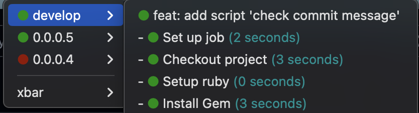

# xbar-cicd-supervision - Github Actions status for a specific Github repository on macOS menu bar

My project "xbar-cicd-supervision" is a Xbar plugin that displays Github Actions status for a specific Github repository in your Mac OS X Menu Bar. Each build are group by branch or tag and only the last build is displayed.

You will no longer be able to say "I didn't see that the build was broken on the CICD" 😉

## Example



## Prerequisites

- [Node.js](https://nodejs.org/)
- [XBar](https://xbarapp.com/)
- Open xbar

## Installation

Make sure you have `node` and `npm`, then run:
```sh
curl https://raw.githubusercontent.com/anthomarquet/xbar-cicd-supervision/master/install.sh | bash
```

## Configuration

Create a `.xbar-cicd-supervisionrc` file in your $HOME with the following content:

```json
{
    "githubToken": "<Your personal classic Git hub token. Ex: aaa_xxxxxxxxxxxxxxxxxxxxxxxxxxxxxxxxxxxxxxxx>",
    "githubRepoName": "<You can get it from the end of the GithHub URL of the project you want to watch. Ex: acme_corporation/my_project>",
}
```

After the configuration, click on xbar your on Mac OS bar and refresh it. Wait a few seconds for the first Github request and voalá. The plugin should starts working.

## githubToken
// **Optional** for public repos, required for privated ones - Your personal classic Git hub token. A forty-digit alphanumeric string.

TLTR: Follow these steps at [docs.github.com](https://docs.github.com/en/authentication/keeping-your-account-and-data-secure/managing-your-personal-access-tokens#creating-a-personal-access-token-classic) to create a personal token (classic).

xbar-cicd-supervision uses [Github Actions API](https://docs.github.com/en/rest/reference/actions). It is possible to use these APIs without any authentication for public repositories. However, for unauthenticated requests, the rate limit allows for up to 60 requests per hour (Details at [docs.github.com](https://docs.github.com/en/rest/overview/resources-in-the-rest-api#rate-limiting)). Authenticated requests have higher limits, up to 5000 requests per hour.

The token does not need to have any specific scope for public repositories. However, the token  needs to have `repo - Full control of private repositories` scope for private repositories.

##

# How it works?
xbar-cicd-supervision uses [Github Actions API](https://docs.github.com/en/rest/reference/actions) to get the related workflow to the recent git push and its status. It keeps on calling the APIs every time your Xbar refreshes. 

# Thanks
Inspired by [Hukum](https://github.com/abskmj/hukum) and [Paulononaka](https://github.com/paulononaka/bitactions) 